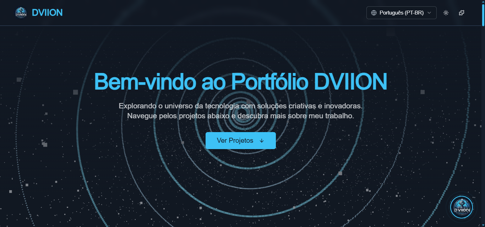

<div align="center">
  
  <h1>Portfólio DVIION Technology</h1>
  <p>
    Um portfólio interativo e dinâmico mostrando os projetos e habilidades de Daniel "Dvizioon" Estevão.
    <br />
    Construído com tecnologias web de ponta e apresentando um assistente com inteligência artificial.
  </p>
</div>

---

## 📜 Índice

- [✨ Conceito do Projeto](#-conceito-do-projeto)
- [🚀 Funcionalidades Chave & Seções](#-funcionalidades-chave--seções)
- [🛠️ Tecnologias Utilizadas](#️-tecnologias-utilizadas)
- [🗺️ Roadmap (Melhorias Futuras)](#️-roadmap-melhorias-futuras)
- [💡 Dicas & Truques para Usuários](#-dicas--truques-para-usuários)
- [⚠️ Observações Importantes](#️-observações-importantes)
- [🔧 Começando (Para Desenvolvedores)](#-começando-para-desenvolvedores)
- [📊 Fluxo de Usuário Conceitual](#-fluxo-de-usuário-conceitual)
- [🤝 Contribuindo](#-contribuindo)
- [📜 Licença](#-licença)

---

## ✨ Conceito do Projeto

O Portfólio DVIION Technology foi projetado para ser mais do que uma simples exibição estática de trabalhos. É uma experiência imersiva que reflete a paixão de Daniel "Dvizioon" Estevão por desenvolvimento backend, soluções inovadoras e tecnologias web modernas. O portfólio visa:

-   **Apresentar** projetos de forma envolvente e interativa.
-   **Destacar** um conjunto diversificado de habilidades, particularmente em sistemas backend, integração de IA e desenvolvimento full-stack.
-   **Fornecer** um assistente com IA (Vizioon Agent) para responder a perguntas sobre projetos e a expertise de Daniel.
-   **Demonstrar** proficiência com uma stack tecnológica moderna, incluindo Next.js, React, TypeScript, ShadCN UI, Tailwind CSS, Genkit para IA.

---

## 🚀 Funcionalidades Chave & Seções

-   **Fundo 3D Interativo**: Um canvas dinâmico em Three.js apresentando uma galáxia estrelada e uma espiral logarítmica rotativa, adaptando-se aos temas selecionados.
-   **Seção de Projetos**: Exibe projetos como cards interativos com:
    -   Imagens, descrições e tecnologias utilizadas.
    -   Links para demonstrações ao vivo (visualizáveis em um modal iframe no app) e repositórios de código fonte.
    -   Opção "Perguntar ao Agente" para mais detalhes sobre um projeto específico via Vizioon AI.
    -   Efeitos visuais ao passar o mouse e partículas animadas nas imagens dos projetos (usando `react-tsparticles`).
-   **Seção de Linha do Tempo**: Uma linha do tempo visualmente atraente e animada, mostrando marcos e experiências chave na jornada de Daniel.
-   **Seção Sobre Mim**: Uma introdução a Daniel "Dvizioon" Estevão, seu background, paixão e foco profissional.
-   **Seção de Habilidades**: Uma exibição categorizada de habilidades técnicas, buscadas dinamicamente de uma API.
-   **Seção de Contato**: Um formulário de contato funcional e links para perfis sociais/profissionais.
-   **Vizioon AI Chat Agent**:
    -   Acessível por um botão flutuante com o logo DVIION.
    -   Potencializado por Genkit e modelos Gemini do Google.
    -   Pode fornecer informações sobre projetos consultando dados de projetos.
    -   Responde em Português ou Inglês com base no idioma selecionado no site.
    -   Exibe respostas em Markdown.
    -   Mostra o status online/offline do agente.
-   **Customização de Tema**: Usuários podem alternar entre os temas Claro, Escuro (Vizioon - padrão) e outros temas potenciais, com a UI e o fundo 3D se adaptando.
-   **Internacionalização (i18n)**: Suporta Português (PT-BR) e Inglês (EN), alternável por um seletor de idioma no cabeçalho.
-   **Modal de Curiosidades**: Acessível por um ícone de quebra-cabeça no cabeçalho, explicando escolhas de design como a espiral 3D.
-   **Design Responsivo**: Visa uma boa experiência do usuário em vários dispositivos, com foco em desktop.

---

## 🛠️ Tecnologias Utilizadas

-   **Frontend**:
    -   Next.js 14+ (App Router)
    -   React 18+
    -   TypeScript
    -   Tailwind CSS
    -   ShadCN UI (Biblioteca de Componentes)
    -   `lucide-react` (Ícones)
    -   `react-tsparticles` e `@tsparticles/basic` (Efeitos de Partículas)
-   **Backend & API**:
    -   Next.js API Routes
-   **Integração AI**:
    -   Genkit (Google)
    -   Modelos Google Gemini (ex: `gemini-1.5-flash-latest`)
-   **Gráficos 3D**:
    -   Three.js
-   **Gerenciamento de Estado**:
    -   React Context API (para Tema & Idioma)
    -   React Hooks (`useState`, `useEffect`, `useCallback`, `useRef`)
-   **Estilização**:
    -   Variáveis CSS, PostCSS (via Tailwind)
-   **Linting/Formatação**:
    -   ESLint, Prettier (suposto, padrão para Next.js)
-   **Implantação**: (Não especificado, mas tipicamente Vercel para projetos Next.js)

---

## 🗺️ Roadmap (Melhorias Futuras)

-   [ ] **Integração de Heatmap de Contribuições do GitHub**: Buscar e exibir dados reais de contribuição do GitHub.
-   [ ] **Capacidades Avançadas do Agente AI**:
    -   Uso de ferramentas mais sofisticadas (ex: resumir artigos externos, geração de imagens para placeholders).
    -   Persistência de memória/contexto entre sessões (potencialmente com consentimento do usuário).
-   [ ] **Seção de Blog**: Para compartilhar artigos, tutoriais ou pensamentos sobre tecnologia.
-   [ ] **Estudos de Caso Detalhados de Projetos**: Expandir descrições de projetos para estudos de caso completos ou linkar para eles.
-   [ ] **Interatividade Aprimorada do Fundo 3D**: Mais elementos interativos ou aspectos controlados pelo usuário na cena 3D.
-   [ ] **Auditoria & Melhorias de Acessibilidade (A11y)**: Garantir altos padrões de acessibilidade.
-   [ ] **Otimização de Performance**: Otimizar ainda mais os tamanhos dos bundles, carregamento de imagens e performance de renderização.
-   [ ] **Painel Admin/CMS**: Para gerenciamento mais fácil de dados de projetos, habilidades e eventos da linha do tempo sem alterações no código.

---

## 💡 Dicas & Truques para Usuários

> [!DICA]
> **Interaja com o Vizioon AI!** Clique no botão com o logo DVIION no canto inferior direito para abrir o chat. Pergunte sobre projetos específicos (ex: "Conte-me mais sobre VIZIOONPOSH") ou as habilidades de Daniel.

> [!DICA]
> **Explore Curiosidades!** Clique no ícone de quebra-cabeça (`<Puzzle />`) no cabeçalho para saber mais sobre a filosofia de design, como o significado por trás da espiral 3D.

> [!DICA]
> **Customize Sua Visualização!** Use o alternador de tema (ícone de sol/lua) no cabeçalho para mudar entre os modos Claro e Escuro (Vizioon). O fundo 3D também se adaptará!

> [!DICA]
> **Mude o Idioma!** Use o ícone de globo no cabeçalho para alternar entre Português e Inglês.

---

## ⚠️ Observações Importantes

> [!AVISO]
> **Limitações do Agente AI**: O Vizioon AI Agent é para fins informativos e demonstrativos. Embora se esforce para ser preciso usando os dados de projeto fornecidos, sempre verifique informações críticas.

> [!NOTA]
> **Suporte WebGL**: Para a melhor experiência visual com o fundo 3D, certifique-se de que seu navegador suporta WebGL e tem aceleração de hardware habilitada.

> [!NOTA]
> **Primeiro Desktop, Responsivo para Mobile**: Embora o portfólio seja projetado para ser responsivo, a experiência mais imersiva é em desktops ou telas maiores.

---

## 🔧 Começando (Para Desenvolvedores)

### Pré-requisitos

-   Node.js (v18.x ou posterior recomendado)
-   npm, yarn, ou pnpm

### Configuração

1.  **Clone o repositório:**
    ```bash
    git clone https://github.com/dvizioon/MY-POSTFOLIO-VIZIOON.git
    cd MY-POSTFOLIO-VIZIOON
    ```

2.  **Instale as dependências:**
    ```bash
    npm install
    # ou
    # yarn install
    # ou
    # pnpm install
    ```

3.  **Configure as Variáveis de Ambiente:**
    Crie um arquivo `.env` na raiz do seu projeto e adicione as seguintes variáveis:
    ```env
    # Para Genkit e Google AI
    GOOGLE_API_KEY=sua_chave_de_api_do_google_aqui

    # Especifica o modelo Google AI para o Genkit (ex: gemini-1.5-flash-latest, gemini-1.5-pro-latest)
    AI_MODEL_ID=gemini-1.5-flash-latest

    # Opcional: Se você planeja integrar funcionalidades da API do GitHub futuramente
    # GITHUB_TOKEN=seu_token_de_acesso_pessoal_do_github_aqui
    ```
    > [!IMPORTANTE]
    > Obtenha sua `GOOGLE_API_KEY` do Google AI Studio ou do Google Cloud Console. Certifique-se de que a chave de API tenha acesso aos modelos Gemini.

4.  **Execute o Servidor de Desenvolvimento Genkit (para funcionalidades de IA):**
    Abra uma nova janela/aba do terminal e execute:
    ```bash
    npm run genkit:watch
    # ou para um início sem monitoramento:
    # npm run genkit:dev
    ```
    Isso iniciará o servidor de desenvolvimento Genkit, geralmente em `http://localhost:3500`.

5.  **Execute o Servidor de Desenvolvimento Next.js:**
    Em outra janela/aba do terminal, execute:
    ```bash
    npm run dev
    ```
    Isso iniciará a aplicação Next.js, tipicamente em `http://localhost:9002`.

6.  Abra [http://localhost:9002](http://localhost:9002) no seu navegador para ver o portfólio.

### Build para Produção

```bash
npm run build
npm run start
```

---

## 📊 Fluxo de Usuário Conceitual

Este diagrama ilustra as principais formas como um usuário pode interagir com o portfólio DVIION:

```mermaid
graph TD
    A[Visitar Página Inicial do Portfólio] --> B{Explorar Seções da Página};
    B --> C[Ver Seção de Projetos];
    C --> C1[Clicar no Card de Projeto];
    C1 --> C1a[Ver Imagem (Modal)];
    C1 --> C1b[Abrir Demo ao Vivo (Modal Iframe)];
    C1 --> C1c[Ver Código (Alerta/Link)];
    C1 --> C1d[Perguntar à IA sobre o Projeto (Abre Chat)];

    B --> E[Ler Seção Sobre Mim];
    B --> F[Verificar Seção de Habilidades];
    B --> G[Navegar na Seção de Linha do Tempo];
    B --> H[Usar Formulário de Contato];

    A --> I[Abrir Widget de Chat (Logo DVIION)];
    I --> J[Fazer Perguntas Gerais ao Vizioon AI];
    J --> K[Obter Detalhes de Projeto via IA];
    J --> L[Obter Informações sobre Habilidades/Experiência];

    A --> M[Usar Controles do Cabeçalho];
    M --> M1[Mudar Tema (Claro/Escuro)];
    M --> M2[Mudar Idioma (PT/EN)];
    M --> M3[Ver Modal de Curiosidades];
end
```

---

## 🤝 Contribuindo

Contribuições são bem-vindas! Se você tiver sugestões de melhorias ou encontrar algum problema, sinta-se à vontade para abrir uma issue ou enviar um pull request.

1.  Faça um Fork do Projeto
2.  Crie sua Feature Branch (`git checkout -b feature/AmazingFeature`)
3.  Faça Commit de suas Mudanças (`git commit -m 'Add some AmazingFeature'`)
4.  Faça Push para a Branch (`git push origin feature/AmazingFeature`)
5.  Abra um Pull Request

---

## 📜 Licença

Distribuído sob a Licença MIT. Veja o arquivo `LICENSE` para mais informações (se um for adicionado).

---

<div align="center">
  Feito com ❤️ por Dvizioon
</div>
